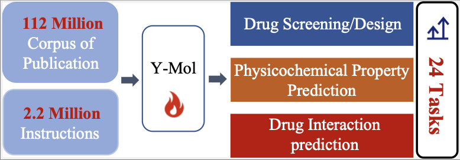

<h1 align="center">   </h1>
<h3 align="center"> A Multi-scale Biomedical Knowledge Guided Large Language Model for Drug Development. </h3>
<p align="center">
  📃 <a href="https://arxiv.org/abs/2410.11550" target="_blank">Paper</a> • ⏬ <a href="https://huggingface.co/collections/Matthewmtf/y-mol-684662d51df6ef64e9cf2e1c" target="_blank">Hugging Face</a><br>
</p>

[](https://github.com/zjunlp/Mol-Instructions/blob/main/LICENSE)
[](https://github.com/zjunlp/Mol-Instructions/blob/main/DATA_LICENSE)


<div align=center></div>

## Abstract
Large Language Models (LLMs) have recently demonstrated remarkable performance in general tasks across various fields. However, their effectiveness within specific domains such as drug development remains challenges. To solve these challenges,  we introduce Y-Mol, forming a well-established LLM paradigm for the flow of drug development. Y-Mol is a multiscale biomedical knowledge-guided LLM designed to accomplish tasks across lead compound discovery, pre-clinic, and clinic prediction. By integrating millions of multiscale biomedical knowledge and using LLaMA2 as the base LLM, Y-Mol augments the reasoning capability in the biomedical domain by learning from a corpus of publications, knowledge graphs, and expert-designed synthetic data. The capability is further enriched with three types of drug-oriented instructions: description-based prompts from processed publications, semantic-based prompts for extracting associations from knowledge graphs, and template-based prompts for understanding expert knowledge from biomedical tools. Besides, Y-Mol offers a set of LLM paradigms that can autonomously execute the downstream tasks across the entire process of drug development, including virtual screening, drug design, pharmacological properties prediction, and drug-related interaction prediction. Our extensive evaluations of various biomedical sources demonstrate that Y-Mol significantly outperforms general-purpose LLMs in discovering lead compounds, predicting molecular properties, and identifying drug interaction events.

## Demo Video
https://github.com/user-attachments/assets/bdcb6ee2-8ed0-4247-b7c1-71ef78d67444

## Requiremetns

All the required packages can be installed by running `pip install -r requirements.txt`.
```
torch>=1.13.1
transformers>=4.37.2
datasets>=2.14.3
accelerate>=0.27.2
peft>=0.10.0
trl>=0.8.1
gradio>=4.0.0
scipy
einops
sentencepiece
protobuf
uvicorn
pydantic
fastapi
sse-starlette
matplotlib
fire
packaging
pyyaml
```

## Datasets
In the self-supervised pretraining stage, we adopt the processed corpus from biomedical publications. The corpus is available at [here](https://drive.google.com/file/d/1c5H8XETytCUQnAI3d9NjslBaHYD5uqRQ/view?usp=sharing).

In the supervised finetuning stage, we construct various instructions under different scenario. The instructions can be downloaded at [here](https://drive.google.com/file/d/1c5H8XETytCUQnAI3d9NjslBaHYD5uqRQ/view?usp=sharing).
The dataset directory has `ddi、dti、Molecular_property_prediction、Molecule_generation` subdirectories, and each subdirectory has two subdirectories: `train and test`. You need to copy the json files in the two subdirectories into the `data` directory.

You can put the downloaded data into the `data` fold.


## Getting Started

### Pretrain

#### Step 1

First, you need to process the data into the following json format and place the file in the `data` directory.

```
{"text": ""}
```

#### Step 2

Next, add the following to the `data/dataset_info.json` file.

```
"wiki_demo": {
        "file_name": "wiki_demo.json",
        "columns": {
            "prompt": "text"
        }
    }
```

#### Step 3

Run `examples/full_multi_gpu/train_llama.sh`，set `--stage  pt`

```
bash examples/full_multi_gpu/train_llama.sh
```

### SFT
#### Step1

Make sure the training data is in the `data` directory and modify the `data/dataset_info.json` file accordingly

#### Step2

Run `examples/full_multi_gpu/train_llama.sh`，set `--stage  sft`

```
bash examples/full_multi_gpu/train_llama.sh
```

### Inference

For molecular property prediction tasks, run examples/full_multi_gpu/predict_mpp.sh.

```
bash examples/full_multi_gpu/predict_mpp.sh
```

For DDI and DTI tasks, run examples/full_multi_gpu/predict_ddi_dti.sh.

```
bash examples/full_multi_gpu/predict_ddi_dti.sh
```

For molecular generation  tasks, run examples/full_multi_gpu/predict_mg.sh.

```
bash examples/full_multi_gpu/predict_mg.sh
```


## Acknowledge
The code is implemented based on LLaMA-Factory (https://github.com/hiyouga/LLaMA-Factory). The base LLM model is LLaMA2-7b (https://huggingface.co/meta-llama/Llama-2-7b-hf/tree/main).
We thank you very much for their sharing and contributions.
